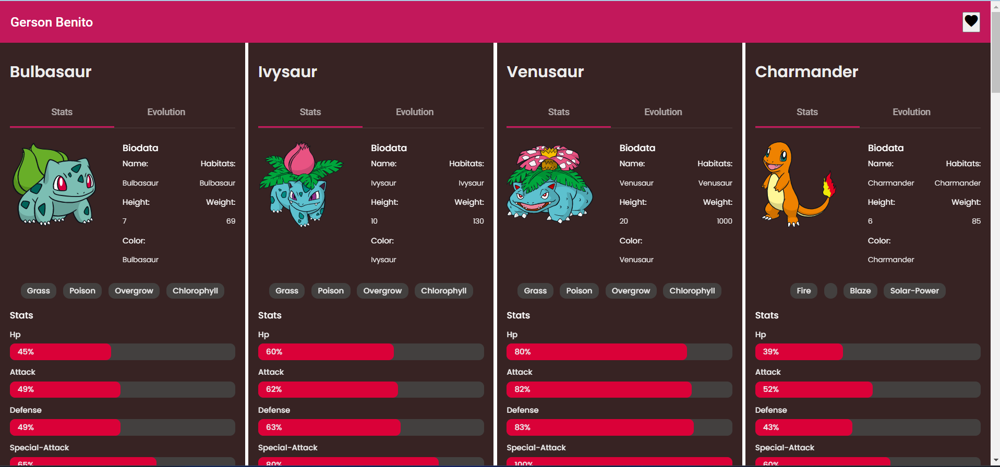
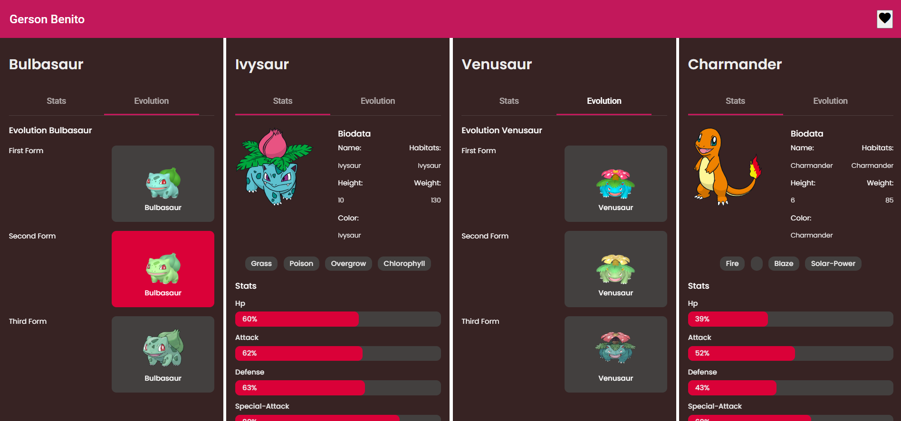
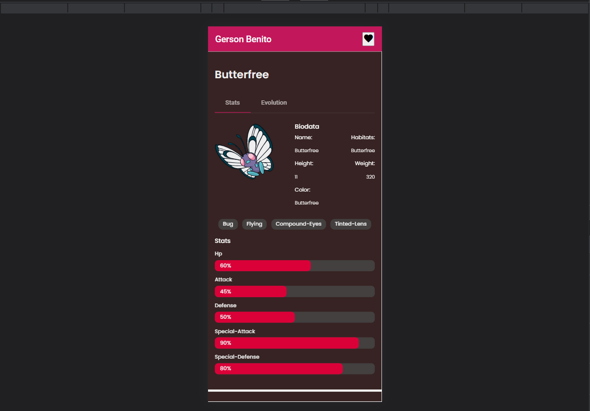
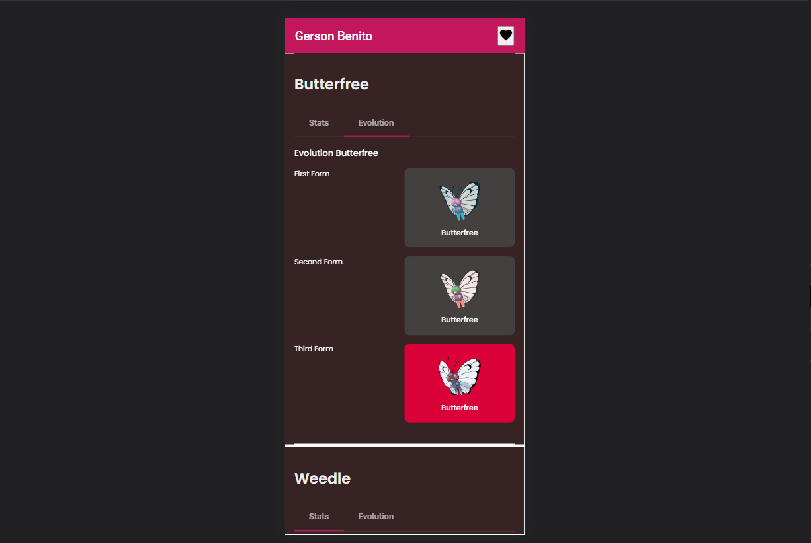

# App card pokemons

This project was generated with [Angular CLI](https://github.com/angular/angular-cli) version 13.2.4.

## Install dependencies

Run `nmp i` for install al dependicies.
## Development server

Run `ng serve` for a dev server. Navigate to `http://localhost:4200/`. The app will automatically reload if you change any of the source files.

## Using API Pokemon

`PokeApi` for more details
[PokeApi](https://pokeapi.co/)

